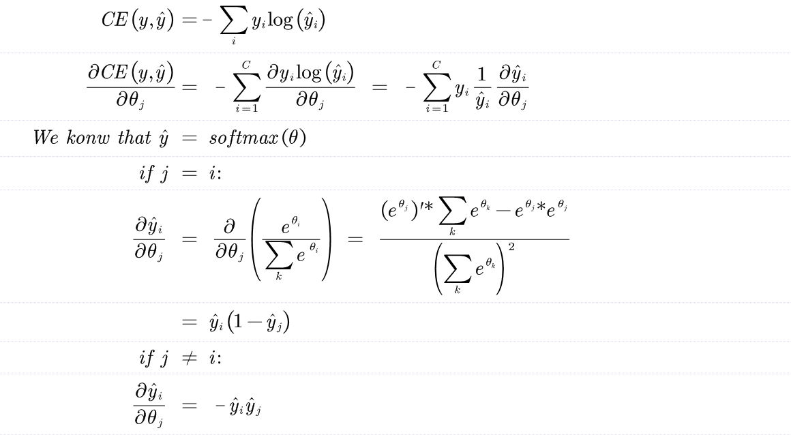
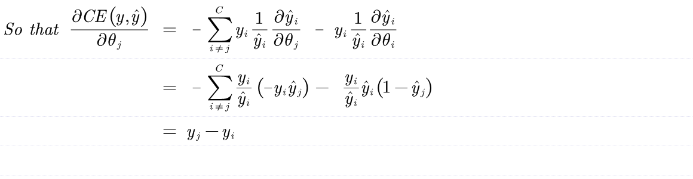
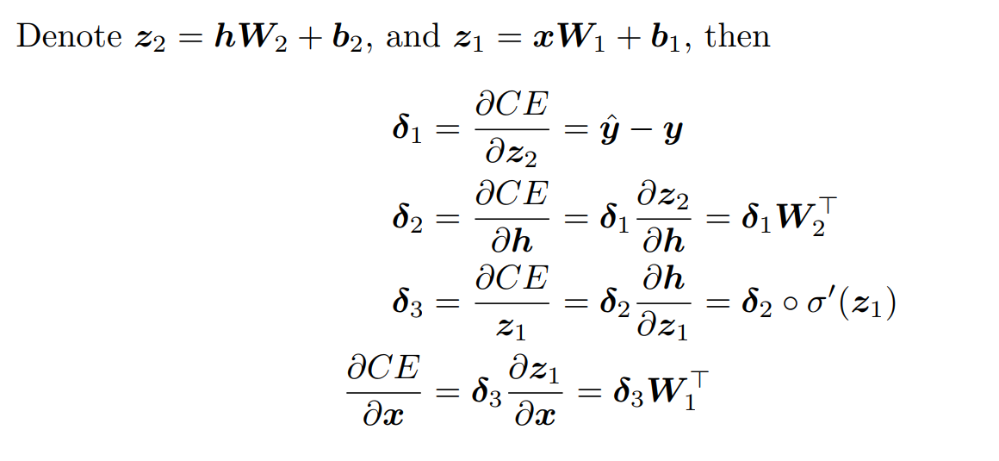
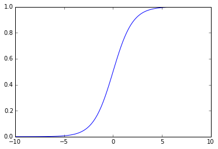
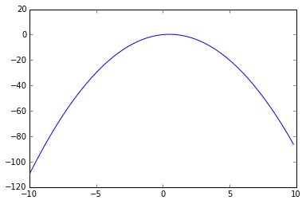
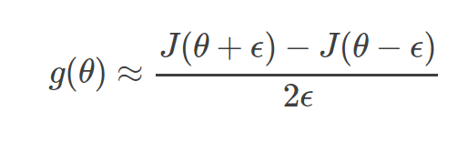

*** Neural Network Basics ***

###  Derive the gradients of the sigmoid function.

So,the sigmoid function is:

$$sigmiod(x) = \sigma (x)$$ 

$$ \sigma '(x) = - \frac{1}{(1+e^{-x})^2} \cdot -e^{-x} $$
$$ =  \frac{1}{1+e^{-x}} \cdot \frac{e^{-x}}{1+e^{-x}} $$
$$ =  \frac{1}{1+e^{-x}} \cdot (1 - \frac{1}{1+e^{-x}}) $$
$$ =  \sigma(x) \cdot (1-\sigma(x)) $$

###  Derive the gradient of the cross entropy function with the softmax fuction.

$$ CE(y,\hat{y}) = - \sum_i y_i log(\hat{y_i}) $$





###  Derive the gradients with respect to the inputs x to an one-hidden-layer neural network.




###  Calculate the value of parameters in this neural network:
assuming the input is *$D_x$*-dimensional,the output is *$D_y$*-dimensional, and there are *H* hidden units?

Similar to the neural network in c:


The anwser is:
(Dx+1)*H+(H+1)*Dy

###  Fill in the implementation for the sigmoid activation function and its gradient 

From the mathematical point of view,The sigmoid function should do it:


```python
def sigmoid(x):
    """
    Arguments:
    x -- A scalar or numpy array.

    Return:
    s -- sigmoid(x)
    """
    s = 1.0/(1+np.exp(-x))
    #raise NotImplementedError
    
    return s
```

And then,my improvement of the gradient for the sigmoid function :


```python
def sigmoid_grad(s):
    """
    Arguments:
    s -- A scalar or numpy array.

    Return:
    ds -- Your computed gradient.
    """

    ds = s*(1.0-s)
    #raise NotImplementedError

    return ds
```

Now you can test iy by calling:
    


```python
import numpy as np
def test_sigmoid_basic():
    """
    Some simple tests to get you started.
    Warning: these are not exhaustive.
    """
    print "Running basic tests..."
    x = np.array([[1, 2], [-1, -2]])
    f = sigmoid(x)
    g = sigmoid_grad(f)
    print f
    f_ans = np.array([
        [0.73105858, 0.88079708],
        [0.26894142, 0.11920292]])
    assert np.allclose(f, f_ans, rtol=1e-05, atol=1e-06)
    print g
    g_ans = np.array([
        [0.19661193, 0.10499359],
        [0.19661193, 0.10499359]])
    assert np.allclose(g, g_ans, rtol=1e-05, atol=1e-06)

test_sigmoid_basic()
```

    Running basic tests...
    [[ 0.73105858  0.88079708]
     [ 0.26894142  0.11920292]]
    [[ 0.19661193  0.10499359]
     [ 0.19661193  0.10499359]]


Now,we use the implemented sigmoid function to create the graph to understand the behavior of this function:


```python
%matplotlib inline
import matplotlib.pyplot as plt

x = np.arange(-10., 10., 0.2)
y = sigmoid(x)
plt.plot(x,y)
plt.show()
```





From the above graph,we can observe that the sigmoid function produces the curve which will be in shape "S",and returns the output value which falls in the range of 0 to 1.
The below are the properties of the Sigmoid function:
- The high value will have the high score but not the higher score.
- Used for binary classification in logistic regression model.
- The probabilities sum need not be 1.

The below is the graph of the gradient of the sigmoid function:


```python
%matplotlib inline
import matplotlib.pyplot as plt

x = np.arange(-10., 10., 0.2)
y = sigmoid_grad(x)
plt.plot(x,y)
plt.show()
```





### To make debugging easier, we will now implement a gradient checker. Fill in the implementation for gradcheck naive in q2 gradcheck.py. 

**Gradient checks**

In theory,performing a gradient check is as simple as comparing the analytic gradient and the numerical gradient.We use the *centered* difference formula of the form:



where ϵ is a very small number,in practice approximately *le-5* or so.
***Use relative for the comparison.***
It is always more appropriate to consider the *relative error*.

- relative error > le-2 usually means the gradient is probably wrong.
- le-7 and less you should be happy.

That means,to implement the gradient check,we would need:


```python
import numpy as np


def gradcheck_naive(f, x):
    """ Gradient check for a function f.

    Arguments:
    f -- a function that takes a single argument and outputs the
         cost and its gradients
    x -- the point (numpy array) to check the gradient at
    """
    rndstate = random.getstate()
    random.setstate(rndstate)
    fx, grad = f(x) # Evaluate function value at original point
    h = 1e-4        # Do not change this!
    # Iterate over all indexes in x
    it = np.nditer(x, flags=['multi_index'], op_flags=['readwrite'])
    while not it.finished:
        ix = it.multi_index
        # Try modifying x[ix] with h defined above to compute
        # numerical gradients. Make sure you call random.setstate(rndstate)
        # before calling f(x) each time. This will make it possible
        # to test cost functions with built in randomness later.
        x[ix] += h
        random.setstate(rndstate)
        fhigh = f(x)[0]
        x[ix] -= 2*h
        random.setstate(rndstate)
        flow = f(x)[0]
        x[ix] += h
        numgrad = ((fhigh-flow)/(2*h)).sum()
        #raise NotImplementedError
        # Compare gradients
        reldiff = abs(numgrad - grad[ix]) / max(1, abs(numgrad), abs(grad[ix]))
        if reldiff > 1e-5:
            print "Gradient check failed."
            print "First gradient error found at index %s" % str(ix)
            print "Your gradient: %f \t Numerical gradient: %f" % (
                grad[ix], numgrad)
            return

        it.iternext() # Step to next dimension

    print "Gradient check passed!"

```

Then generate trial function that are used by multiple tests:


```python
import random

def sanity_check():
    """
    Some basic sanity checks.
    """
    quad = lambda x: (np.sum(x ** 2), x * 2)

    print "Running sanity checks..."
    gradcheck_naive(quad, np.array(123.456))      # scalar test
    gradcheck_naive(quad, np.random.randn(3,))    # 1-D test
    gradcheck_naive(quad, np.random.randn(4,5))   # 2-D test
    print ""

sanity_check()
```

    Running sanity checks...
    Gradient check passed!
    Gradient check passed!
    Gradient check passed!
    


```python
def your_sanity_checks():

    print "Running your sanity checks..."
    test1_function = lambda x: (np.log(x), 1/x)
    print "The original function is: ln(x)"
    gradcheck_naive(test1_function, np.array(123.456))      # scalar test
    #gradcheck_naive(test1_function, np.random.randn(3,))    # 1-D test
    #gradcheck_naive(test1_function, np.random.randn(4,5))   # 2-D test

    test2_function = lambda x: (np.sin(x)-np.cos(x), np.cos(x)+np.sin(x))
    print "The original function is: sin(x)-cos(x)"
    gradcheck_naive(test2_function, np.array(123.456))      # scalar test
    gradcheck_naive(test2_function, np.random.randn(3,))    # 1-D test
    gradcheck_naive(test2_function, np.random.randn(4,5))   # 2-D test

    test3_function = lambda x: (np.exp(x), np.exp(x))
    print "The original function is: exp(x)"
    gradcheck_naive(test3_function, np.array(123.456))      # scalar test
    gradcheck_naive(test3_function, np.random.randn(3,))    # 1-D test
    gradcheck_naive(test3_function, np.random.randn(4,5))   # 2-D test
your_sanity_checks()
```

    Running your sanity checks...
    The original function is: ln(x)
    Gradient check passed!
    The original function is: sin(x)-cos(x)
    Gradient check passed!
    Gradient check passed!
    Gradient check passed!
    The original function is: exp(x)
    Gradient check passed!
    Gradient check passed!
    Gradient check passed!


###  implement the forward and backward passes for a neural network with one sigmoid hidden layer. 

Let's consider a simple logistic regression classifier.

The ***forward*** pass computes the output given the input for inference.In forward composes the computation of each layer to computation of each layer to compute the "function" represented by the model.


The ***backward*** pass computes the gradient given the loss for learning.In backward composes the gradient of each layer to compute the gradient of the whole model by automatic differentiation.


The below is my implementation:


```python
def forward_backward_prop(data, labels, params, dimensions):
    """
    Forward and backward propagation for a two-layer sigmoidal network

    Compute the forward propagation and for the cross entropy cost,
    and backward propagation for the gradients for all parameters.

    Arguments:
    data -- M x Dx matrix, where each row is a training example.
    labels -- M x Dy matrix, where each row is a one-hot vector.
    params -- Model parameters, these are unpacked for you.
    dimensions -- A tuple of input dimension, number of hidden units
                  and output dimension
    """
    ### Unpack network parameters (do not modify)
    ofs = 0
    Dx, H, Dy = (dimensions[0], dimensions[1], dimensions[2])
    W1 = np.reshape(params[ofs:ofs+ Dx * H], (Dx, H))
    ofs += Dx * H
    b1 = np.reshape(params[ofs:ofs + H], (1, H))
    ofs += H
    W2 = np.reshape(params[ofs:ofs + H * Dy], (H, Dy))
    ofs += H * Dy
    b2 = np.reshape(params[ofs:ofs + Dy], (1, Dy))
    
    ### forward propagation
    hidden_value = sigmoid(np.dot(data,W1)+b1)
    y_value = softmax(np.dot(hidden_value,W2)+b2)
    cost = np.sum(-np.log(y_value[labels == 1]))/data.shape[0]

    ### backward propagation
    d_y = (y_value-labels)/data.shape[0]
    gradW2 = np.dot(hidden_value.T, d_y)
    gradb2 = np.sum(d_y,axis=0,keepdims=True)
    gradh = np.dot(d_y,W2.T)*sigmoid_grad(hidden_value)
    gradW1 = np.dot(data.T, gradh)
    gradb1 = np.sum(gradh,axis=0,keepdims=True)

    ### Stack gradients (do not modify)
    grad = np.concatenate((gradW1.flatten(), gradb1.flatten(),
        gradW2.flatten(), gradb2.flatten()))

    return cost, grad
```

Then generate trial function that is used by test:


```python
from sklearn.utils.extmath import softmax
def sanity_check():
    """
    Set up fake data and parameters for the neural network, and test using
    gradcheck.
    """
    print "Running sanity check..."

    N = 20
    dimensions = [10, 5, 10]
    data = np.random.randn(N, dimensions[0])   # each row will be a datum
    labels = np.zeros((N, dimensions[2]))
    for i in xrange(N):
        labels[i, random.randint(0,dimensions[2]-1)] = 1

    params = np.random.randn((dimensions[0] + 1) * dimensions[1] + (
        dimensions[1] + 1) * dimensions[2], )
    gradcheck_naive(lambda params:
        forward_backward_prop(data, labels, params, dimensions), params)
sanity_check()
```

    Running sanity check...
    Gradient check passed!
