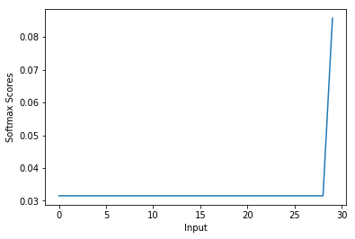

 ***Softmax***

## The property of softmax function
(a) prove that ***softmax*** is invariant to constant offsets in the input,that is, for any input vecotr ***x*** and any constant ***c***,
$$softmax(x + c) = softmax(x)$$
which ***x+c*** means adding the constant ***c*** to every dimension of ***x***.

First all of,to prove the ***softmax*** function:

$$softmax(x_i + c) = \frac {e^{x_i + c}}{\sum_j e^{x_i + c}} $$
$$ = \frac {e^x_i \cdot e^c}{\sum_j e^{x_i} \cdot e^c} $$
$$ = \frac {e^x_i}{\sum_j e^{x_i}} $$
$$ = softmax(x_i) $$


## Implementation in python.
(b)Write my implementation in ***q1_softmax.py*** and test it.

From the mathematical point of view,let's try my solution(***Jacksoftmax***):


```python
import numpy as np
def Jacksoftmax(x):
    """Compute the softmax function for each row of the input x.
    Arguments:
    x -- A N dimensional vector or M x N dimensional numpy matrix.
    Return:
    x -- You are allowed to modify x in-place
    """
    orig_shape = x.shape
    if len(x.shape) > 1:
        # Matrix
        max_row = np.max(x, axis=1)
        e_x = np.exp(x - max_row[:,np.newaxis])
        div = np.sum(e_x, axis=1)
        x = e_x/div[:,np.newaxis]
        #raise NotImplementedError
    else:
        # Vector
        x = np.exp((x-x.min())/(x.max()-x.min()))
        sum_column = sum(x)
        for i in range(x.size):
            x[i] = x[i]/float(sum_column)
        #raise NotImplementedError
    assert x.shape == orig_shape
    return x
```

Let's take basic test example:


```python
from sklearn.utils.extmath import softmax

def test_softmax_basic():
    """
    Some simple tests to get you started.
    Warning: these are not exhaustive.
    """
    print "This is the out:"
    test1 = Jacksoftmax(np.array([1,2]))
    print test1
    ans1 = np.array([0.26894142,  0.73105858])
    assert np.allclose(test1, ans1, rtol=1e-05, atol=1e-06)

    test2 = Jacksoftmax(np.array([[1001,1002],[3,4]]))
    print test2
    ans2 = np.array([
        [0.26894142, 0.73105858],
        [0.26894142, 0.73105858]])
    assert np.allclose(test2, ans2, rtol=1e-05, atol=1e-06)

    test3 = Jacksoftmax(np.array([[-1001,-1002]]))
    print test3
    ans3 = np.array([0.73105858, 0.26894142])
    assert np.allclose(test3, ans3, rtol=1e-05, atol=1e-06)
    
test_softmax_basic()
```

    This is the out:
    [ 0.26894142  0.73105858]
    [[ 0.26894142  0.73105858]
     [ 0.26894142  0.73105858]]
    [[ 0.73105858  0.26894142]]


Use this space to test your softmax implementation by running:
        python q1_softmax.py
        


```python
def test_softmax():
    print "Running your tests..."
    print "Enter the dimension of the matrix:"
    n = input()
    m = input()
    test1 = np.random.random((n,m))
    print "The first sample is:"
    print test1
    sk_array1 = softmax(test1)
    print "The answer with softmax of sklearn:"
    print sk_array1
    jk_array1 = Jacksoftmax(test1)
    print "The answer with my softmax:"
    print jk_array1
    assert np.allclose(sk_array1, jk_array1, rtol=1e-05, atol=1e-06)
    test2 = 2.5 * np.random.randn(n,m)+3
    print "The second sample is:"
    print test2
    sk_array2 = softmax(test2)
    print "The answer with softmax of sklearn:"
    print sk_array2
    jk_array2 = Jacksoftmax(test2)
    print "The answer with my softmax:"
    print jk_array2
    assert np.allclose(sk_array2, jk_array2, rtol=1e-05, atol=1e-06)
test_softmax()
```

    Running your tests...
    Enter the dimension of the matrix:
    3
    5
    The first sample is:
    [[ 0.0345306   0.18920816  0.49485403  0.03642509  0.90002219]
     [ 0.9100086   0.61635177  0.8217402   0.69910275  0.59564619]
     [ 0.01915225  0.8879781   0.35720632  0.57615048  0.09329815]]
    The answer with softmax of sklearn:
    [[ 0.14025367  0.16371552  0.22224406  0.14051963  0.33326711]
     [ 0.23802995  0.17745901  0.21792002  0.19276863  0.1738224 ]
     [ 0.13142823  0.31333935  0.18429081  0.22939815  0.14154346]]
    The answer with my softmax:
    [[ 0.14025367  0.16371552  0.22224406  0.14051963  0.33326711]
     [ 0.23802995  0.17745901  0.21792002  0.19276863  0.1738224 ]
     [ 0.13142823  0.31333935  0.18429081  0.22939815  0.14154346]]
    The second sample is:
    [[ 4.43086839  4.35889742 -1.00466532  0.65716001  6.19049139]
     [ 5.66895751  3.98764183  5.77718425 -0.33103714 -0.18460528]
     [-1.35308692  1.1158278  -0.9865306   3.25704449  0.23047689]]
    The answer with softmax of sklearn:
    [[  1.28731109e-01   1.19791752e-01   5.61127060e-04   2.95653336e-03
        7.47959479e-01]
     [  4.33693148e-01   8.07228412e-02   4.83264437e-01   1.07502359e-03
        1.24455056e-03]
     [  8.35966458e-03   9.87244880e-02   1.20609700e-02   8.40124177e-01
        4.07307003e-02]]
    The answer with my softmax:
    [[  1.28731109e-01   1.19791752e-01   5.61127060e-04   2.95653336e-03
        7.47959479e-01]
     [  4.33693148e-01   8.07228412e-02   4.83264437e-01   1.07502359e-03
        1.24455056e-03]
     [  8.35966458e-03   9.87244880e-02   1.20609700e-02   8.40124177e-01
        4.07307003e-02]]


Follow the result i will get the correct answer by doing vectorization.

## How to use it?
Now,We use the implemented softmax function to create the graph to understand the behavior of this function:
- To create a list which contains values in the range of 0 to 10
- Next,pass the list to calculate the scores from the softmax function
- To create a graph.


```python
import matplotlib.pyplot as plt

%matplotlib inline
def softmax_graph(x, y, x_title, y_title):
    plt.plot(x, y)
    plt.xlabel(x_title)
    plt.ylabel(y_title)
    plt.show()


x = np.arange(0,30)
y = Jacksoftmax(x)
print x
print y
softmax_graph(x, y, "Input", "Softmax Scores")
```

    [ 0  1  2  3  4  5  6  7  8  9 10 11 12 13 14 15 16 17 18 19 20 21 22 23 24
     25 26 27 28 29]
    [ 0.03152756  0.03152756  0.03152756  0.03152756  0.03152756  0.03152756
      0.03152756  0.03152756  0.03152756  0.03152756  0.03152756  0.03152756
      0.03152756  0.03152756  0.03152756  0.03152756  0.03152756  0.03152756
      0.03152756  0.03152756  0.03152756  0.03152756  0.03152756  0.03152756
      0.03152756  0.03152756  0.03152756  0.03152756  0.03152756  0.08570079]





The figure shows the property of softmax function:
*** The high value gets the hign score(means probability).***

We can use the softmax function to multi-classification task.